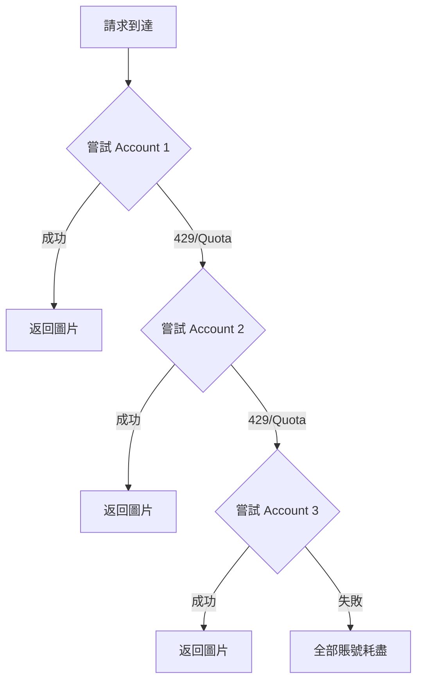

# 🎨 Cloudflare FLUX.2 Workers AI API

> 基於 Cloudflare Workers AI 的 FLUX.2 [dev] 圖像生成 API，使用 REST API 調用，支持多圖輸入、角色一致性和 JSON 高級提示詞控制。**支持多賬號故障轉移策略，突破免費額度限制！**

[](https://deploy.workers.cloudflare.com/?url=https://github.com/kinai9661/cf-flux2)

## ✨ 特性

- 🚀 **REST API 調用**：使用官方 Cloudflare API 調用 FLUX.2 [dev] 模型
- 🖼️ **多圖輸入**：支持最多 4 張參考圖片，實現角色/產品一致性
- 📝 **JSON Prompting**：支持結構化 JSON 提示詞進行精確控制
- 🎯 **靈活尺寸**：支持從 512×512 到 1920×1080 等多種尺寸
- 🎨 **現代化 UI**：美觀的深色主題 Web 界面
- 🔌 **API 兼容**：兼容 OpenAI 圖像生成 API 格式
- ⚡ **極速部署**：一鍵部署到 Cloudflare Workers
- 🔒 **安全可靠**：API Key 驗證保護
- 📊 **健康檢查**：內置 `/health` 端點監控狀態
- 💸 **免費啟動成本低**：利用 Cloudflare Workers 免費計劃 + Workers AI 免費額度即可跑起來
- 🔄 **多賬號故障轉移**：支持配置多個 Cloudflare 賬號，自動切換突破免費額度限制！

## 💸 Cloudflare 免費用量說明

Cloudflare Workers 與 Workers AI 都提供了足夠做 Side Project、Demo、個人玩具站的免費額度，搭配本項目可以做到「**0 月費起步**」。具體數值請以官方文檔為準，這裡給出大致等級方便評估用量。

### Workers 免費層（CPU / 請求數）

- 每個帳號每天約 **100,000 次 Worker 請求**（適用於本項目前端 UI + API 包裝層）
- 單次請求約 **10ms CPU 時間**，對於簡單的 API 轉發/參數處理完全足夠
- 超出後可以升級到付費方案，價格以「請求數 + CPU 使用量」計費

### Workers AI 免費額度（Neurons / 天）

- Workers AI 按「**Neurons**」計費，不同模型消耗不同 Neuron 單價
- 免費帳號通常會有一個「**每日免費 Neuron 配額**」，足夠個人測試與小規模部署使用
- 超出免費 Neuron 後，才會按量計費；費率與模型類型有關，官方定價頁會定期更新

### 🔄 多賬號突破限制

本項目 **v1.2.0** 版本新增**多賬號故障轉移策略**：

- 配置多個 Cloudflare 免費賬號（最多 10 個）
- 當某個賬號達到免費額度時，**自動切換**到下一個可用賬號
- 零成本突破單賬號限制，日生成量可擴展 3-10 倍！

> 建議：先在免費層跑通整個流程，觀察實際 Neuron 消耗，再決定是否升級到付費方案或限制前端使用頻率。

---

## 🚀 快速開始

### 前置要求

1. **Cloudflare 賬戶**（免費即可）
2. **Cloudflare API Token**
3. **Cloudflare Account ID**
4. **（可選）多個 Cloudflare 賬戶**用於突破免費額度限制

### 步驟 1：獲取 Cloudflare 憑證

#### 1.1 獲取 Account ID

1. 登錄 [Cloudflare Dashboard](https://dash.cloudflare.com/)
2. 選擇任意網站/域名（如果沒有，可以添加一個免費域名）
3. 在頁面右側欄找到 **"Account ID"**
4. 點擊複製（格式類似：`a1b2c3d4e5f6g7h8i9j0k1l2m3n4o5p6`）


#### 1.2 創建 API Token

1. 登錄 [Cloudflare Dashboard](https://dash.cloudflare.com/)
2. 點擊右上角頭像 → **My Profile**
3. 選擇左側 **API Tokens** 標籤
4. 點擊 **Create Token**
5. 選擇 **"Edit Cloudflare Workers"** 模板
6. 或創建自定義 Token，確保權限包含：
   - `Account.Workers AI:Read`
   - `Account.Workers Scripts:Edit`
7. 點擊 **Continue to summary** → **Create Token**
8. **立即複製 Token**（只會顯示一次！）

> 💡 **多賬號配置提示**：如果要使用多賬號功能，請為每個 Cloudflare 賬號重複以上步驟。

### 步驟 2：部署到 Cloudflare Workers

#### 方法 A：通過 Cloudflare Dashboard（推薦，無需本地環境）

1. **Fork 本倉庫**到您的 GitHub 賬戶

2. **連接 GitHub**：
   - 登錄 [Cloudflare Dashboard](https://dash.cloudflare.com/)
   - 進入 **Workers & Pages**
   - 點擊 **Create application** → **Pages** → **Connect to Git**
   - 授權並選擇 `cf-flux2` 倉庫

3. **配置環境變量**：
   - 在部署設置頁面，找到 **Environment variables**
   - 添加以下變量：

   **單賬號模式（基礎配置）：**
   ```
   API_MASTER_KEY = your-secret-key-here
   CF_API_TOKEN_1 = your-cloudflare-api-token
   ACCOUNT_1 = your-cloudflare-account-id
   ```

   **多賬號模式（推薦，突破限制）：**
   ```
   API_MASTER_KEY = your-secret-key-here
   
   # 賬號 1
   CF_API_TOKEN_1 = token_from_account_1
   ACCOUNT_1 = account_id_1
   
   # 賬號 2
   CF_API_TOKEN_2 = token_from_account_2
   ACCOUNT_2 = account_id_2
   
   # 賬號 3
   CF_API_TOKEN_3 = token_from_account_3
   ACCOUNT_3 = account_id_3
   
   # ... 最多支持到 ACCOUNT_10
   ```

4. **部署**：
   - 點擊 **Save and Deploy**
   - 等待部署完成

5. **訪問**：
   - 部署成功後，訪問分配的 Workers 域名

#### 方法 B：本地部署（需要 Node.js）

```bash
# 1. 克隆倉庫
git clone https://github.com/kinai9661/cf-flux2.git
cd cf-flux2

# 2. 安裝 Wrangler CLI
npm install -g wrangler

# 3. 登錄 Cloudflare
wrangler login

# 4. 創建 .dev.vars 文件（不要提交到 Git）
cat > .dev.vars << EOF
API_MASTER_KEY=your-secret-key

# 單賬號配置
CF_API_TOKEN_1=your-token-1
ACCOUNT_1=your-account-id-1

# 多賬號配置（可選）
CF_API_TOKEN_2=your-token-2
ACCOUNT_2=your-account-id-2

CF_API_TOKEN_3=your-token-3
ACCOUNT_3=your-account-id-3
EOF

# 5. 部署
wrangler deploy
```

### 步驟 3：配置環境變量（如果使用 Workers）

如果直接部署為 Worker（而非 Pages）：

1. 進入 **Workers & Pages** → 選擇您的 Worker
2. 點擊 **Settings** → **Variables**
3. 添加環境變量（參考上面的配置）
4. 點擊 **Save and deploy**

### 步驟 4：驗證部署

訪問健康檢查端點：

```bash
curl https://your-worker.workers.dev/health
```

**單賬號響應示例：**
```json
{
  "status": "ok",
  "version": "1.2.0",
  "mode": "Multi-Account Fallback Strategy",
  "model": "@cf/black-forest-labs/flux-2-dev",
  "total_accounts": 1,
  "accounts_configured": ["Account 1"]
}
```

**多賬號響應示例：**
```json
{
  "status": "ok",
  "version": "1.2.0",
  "mode": "Multi-Account Fallback Strategy",
  "model": "@cf/black-forest-labs/flux-2-dev",
  "total_accounts": 3,
  "accounts_configured": ["Account 1", "Account 2", "Account 3"]
}
```

---

## 🔄 多賬號故障轉移策略

### 工作原理



### 自動檢測的錯誤類型

系統會自動檢測以下錯誤並切換賬號：

- ✅ HTTP 429 (Too Many Requests)
- ✅ "quota" 關鍵字錯誤
- ✅ "rate limit" 關鍵字錯誤
- ✅ "too many requests" 關鍵字錯誤

### 日誌示例

```
⚙️ Trying Account 1...
❌ Account 1 failed: Cloudflare API error (429): quota exceeded
🔄 Account 1 rate limited, trying next account...
⚙️ Trying Account 2...
✅ Success with Account 2
```

### 效果估算

假設每個免費賬號每天可生成 **100 張 1024×1024 圖片**：

| 配置賬號數 | 每日生成量 | 月度生成量 | 年度生成量 | 成本 |
|-----------|-----------|-----------|-----------|------|
| 1 個      | ~100 張   | ~3,000 張 | ~36,000 張| $0   |
| 3 個      | ~300 張   | ~9,000 張 | ~108,000 張| $0   |
| 5 個      | ~500 張   | ~15,000 張| ~180,000 張| $0   |
| 10 個     | ~1,000 張 | ~30,000 張| ~360,000 張| $0   |

### UI 狀態顯示

- **配置狀態**：顯示已配置的賬號數量
- **生成結果**：顯示使用的具體賬號編號
- **實時提示**：生成時提示"如遇配額限制會自動切換賬號"

---

## 📖 使用指南

### Web UI 界面

訪問您的 Workers 域名，即可看到現代化的 Web 界面：

1. **配置狀態指示器**
   - ✅ 綠色：環境變量已正確配置，顯示賬號數量
   - ❌ 紅色：缺少必需的環境變量

2. **輸入提示詞**
   - 支持純文本描述
   - 支持 JSON 格式高級控制

3. **上傳參考圖片**（可選）
   - 拖拽或點擊上傳
   - 最多 4 張圖片
   - 保持角色/產品一致性

4. **選擇圖片尺寸**
   - 512×512（快速預覽）
   - 1024×1024（標準）
   - 1024×768、768×1024
   - 1280×720、1536×1024
   - 1920×1080（高清）

5. **調整生成參數**
   - Steps：推薦 25（範圍 10-50）
   - Seed：可選，固定結果用

6. **生成與下載**
   - 點擊生成按鈕
   - 完成後顯示使用的賬號編號
   - 可直接下載圖片

### API 調用示例

#### 基礎文本生成

```bash
curl https://your-worker.workers.dev/v1/images/generations \
  -H "Authorization: Bearer your-api-key" \
  -H "Content-Type: application/json" \
  -d '{
    "prompt": "A serene Japanese garden with cherry blossoms",
    "steps": 25,
    "width": 1024,
    "height": 1024
  }'
```

**響應示例：**
```json
{
  "id": "gen_abc123",
  "object": "image.generation",
  "created": 1702234567,
  "model": "@cf/black-forest-labs/flux-2-dev",
  "account_used": 2,
  "data": [{
    "b64_json": "iVBORw0KGgoAAAANSUhEUgAA...",
    "prompt": "A serene Japanese garden with cherry blossoms"
  }]
}
```

> 注意：`account_used` 字段顯示使用的賬號編號。

#### 帶參考圖片（multipart/form-data）

```bash
curl https://your-worker.workers.dev/v1/images/generations \
  -H "Authorization: Bearer your-api-key" \
  -F "prompt=A cyberpunk portrait of the person in the image" \
  -F "input_image_0=@reference.jpg" \
  -F "steps=30" \
  -F "width=1024" \
  -F "height=1024"
```

#### Python 示例

```python
import requests
import base64

url = "https://your-worker.workers.dev/v1/images/generations"
headers = {
    "Authorization": "Bearer your-api-key",
    "Content-Type": "application/json"
}

# JSON Prompting 示例
payload = {
    "prompt": {
        "scene": "futuristic city",
        "subjects": [{
            "type": "robot",
            "pose": "standing",
            "expression": "friendly"
        }],
        "style": "cyberpunk digital art",
        "lighting": "neon lights",
        "color_palette": ["#667eea", "#f5576c", "#00d4ff"]
    },
    "steps": 25,
    "width": 1920,
    "height": 1080
}

response = requests.post(url, json=payload, headers=headers)
data = response.json()

if data.get("data"):
    img_base64 = data["data"][0]["b64_json"]
    account_used = data.get("account_used", "unknown")
    
    with open("output.png", "wb") as f:
        f.write(base64.b64decode(img_base64))
    
    print(f"✅ 圖片已保存為 output.png（使用賬號 {account_used}）")
```

#### JavaScript (Node.js)

```javascript
import fetch from 'node-fetch';
import FormData from 'form-data';
import fs from 'fs';

const url = 'https://your-worker.workers.dev/v1/images/generations';
const apiKey = 'your-api-key';

// 帶參考圖片的生成
const form = new FormData();
form.append('prompt', 'Portrait of the person in cyberpunk style');
form.append('input_image_0', fs.createReadStream('reference.jpg'));
form.append('steps', '30');
form.append('width', '1024');
form.append('height', '1024');

const response = await fetch(url, {
  method: 'POST',
  headers: {
    'Authorization': `Bearer ${apiKey}`,
    ...form.getHeaders()
  },
  body: form
});

const data = await response.json();
console.log(`✅ 生成成功！使用賬號 ${data.account_used}`, data);
```

---

## 🎯 高級功能

### JSON 結構化提示詞

FLUX.2 支持 JSON 格式的結構化提示詞，可以進行更精確的控制：

```json
{
  "prompt": {
    "scene": "modern office",
    "subjects": [
      {
        "type": "person",
        "appearance": "professional businessman",
        "pose": "sitting at desk",
        "clothing": "navy blue suit"
      }
    ],
    "environment": {
      "location": "corner office",
      "time_of_day": "golden hour",
      "weather": "clear sky visible through window"
    },
    "style": "photorealistic",
    "mood": "confident and focused",
    "color_palette": ["#2c3e50", "#ecf0f1", "#f39c12"],
    "composition": "rule of thirds",
    "camera": {
      "angle": "eye level",
      "lens": "35mm",
      "depth_of_field": "shallow"
    }
  },
  "steps": 30,
  "width": 1920,
  "height": 1080,
  "seed": 42
}
```

### 多圖輸入（角色一致性）

使用多張參考圖片保持角色或產品的一致性：

```bash
curl https://your-worker.workers.dev/v1/images/generations \
  -H "Authorization: Bearer your-api-key" \
  -F "prompt=The character in different poses: standing, sitting, running" \
  -F "input_image_0=@character_front.jpg" \
  -F "input_image_1=@character_side.jpg" \
  -F "input_image_2=@character_back.jpg" \
  -F "steps=35" \
  -F "width=1536" \
  -F "height=1024"
```

### 支持的圖片尺寸

| 尺寸 | 比例 | 適用場景 | 推薦 Steps |
|------|------|----------|------------|
| 512×512 | 1:1 | 快速預覽、圖標 | 15-20 |
| 1024×1024 | 1:1 | 頭像、社交媒體 | 20-30 |
| 1024×768 | 4:3 | 標準照片 | 25-35 |
| 768×1024 | 3:4 | 豎版海報 | 25-35 |
| 1280×720 | 16:9 | 視頻縮略圖 | 25-35 |
| 1536×1024 | 3:2 | 寬屏照片 | 30-40 |
| 1920×1080 | 16:9 | 高清壁紙 | 35-50 |

---

## 🔧 配置說明

### 環境變量

| 變量 | 必需 | 說明 | 獲取方式 |
|------|------|------|----------|
| `API_MASTER_KEY` | ✅ 是 | API 訪問密鑰 | 自定義設置 |
| `CF_API_TOKEN_1` | ✅ 是 | Cloudflare API Token（賬號1） | Dashboard → Profile → API Tokens |
| `ACCOUNT_1` | ✅ 是 | Cloudflare Account ID（賬號1） | Dashboard → 任意網站 → 右側欄 Account ID |
| `CF_API_TOKEN_2` | ⚪ 否 | Cloudflare API Token（賬號2） | 同上 |
| `ACCOUNT_2` | ⚪ 否 | Cloudflare Account ID（賬號2） | 同上 |
| ... | ⚪ 否 | 最多支持到 `_10` | 同上 |

### wrangler.toml 示例

```toml
name = "flux2-workers-ai"
main = "worker.js"
compatibility_date = "2024-12-10"

[vars]
API_MASTER_KEY = "your-secret-key-here"

# 單賬號配置
CF_API_TOKEN_1 = "your-cloudflare-api-token"
ACCOUNT_1 = "your-cloudflare-account-id"

# 多賬號配置（可選）
CF_API_TOKEN_2 = "your-cloudflare-api-token-2"
ACCOUNT_2 = "your-cloudflare-account-id-2"

CF_API_TOKEN_3 = "your-cloudflare-api-token-3"
ACCOUNT_3 = "your-cloudflare-account-id-3"
```

⚠️ **安全提示**：
- 不要在 `wrangler.toml` 中直接寫入真實的 Token 和 Account ID
- 使用 Cloudflare Dashboard 的環境變量功能
- 或使用 `.dev.vars` 文件（本地開發，不提交到 Git）

### 健康檢查

訪問 `/health` 端點查看配置狀態：

```bash
curl https://your-worker.workers.dev/health
```

響應示例：
```json
{
  "status": "ok",
  "version": "1.2.0",
  "mode": "Multi-Account Fallback Strategy",
  "model": "@cf/black-forest-labs/flux-2-dev",
  "total_accounts": 3,
  "accounts_configured": ["Account 1", "Account 2", "Account 3"]
}
```

---

## 📊 API 響應格式

### 成功響應

```json
{
  "id": "gen_1234567890",
  "object": "image.generation",
  "created": 1702234567,
  "model": "@cf/black-forest-labs/flux-2-dev",
  "account_used": 2,
  "data": [
    {
      "b64_json": "iVBORw0KGgoAAAANSUhEUgAA...",
      "prompt": "A serene Japanese garden with cherry blossoms",
      "revised_prompt": "A serene Japanese garden with cherry blossoms"
    }
  ]
}
```

### 錯誤響應

```json
{
  "error": {
    "message": "All 3 accounts exhausted. Attempted accounts: [1, 2, 3]. Last error: quota exceeded",
    "type": "api_error"
  }
}
```

---

## 🌟 最佳實踐

### 提示詞優化

1. **清晰具體**：描述具體細節而非抽象概念
   - ❌ "A nice landscape"
   - ✅ "A misty mountain valley at sunrise with pine trees and a river"

2. **使用 JSON 結構**：對於複雜場景使用 JSON 格式
3. **參考圖片**：上傳參考圖保持風格一致
4. **調整 Steps**：
   - 快速預覽：10-15 steps
   - 標準質量：20-30 steps
   - 高質量：35-50 steps

### 多賬號配置建議

1. **起步配置**：至少配置 2-3 個賬號
2. **生產環境**：建議 5 個以上賬號確保穩定性
3. **賬號隔離**：使用不同郵箱註冊，避免關聯
4. **定期檢查**：通過 `/health` 端點監控賬號狀態
5. **日誌監控**：關注 Worker 日誌，觀察賬號切換頻率

### 性能優化

- **REST API**：直接調用 Cloudflare API，穩定可靠
- **適當尺寸**：根據需求選擇合適尺寸，避免過大
- **批量處理**：使用異步處理多個請求
- **緩存結果**：相同參數可緩存結果（使用 seed 固定）
- **賬號輪換**：多賬號模式下自動分散負載

---

## 🔧 故障排除

### 常見問題

**Q: 部署失敗提示 "No Cloudflare accounts configured"**  
A: 請至少配置一組環境變量：
- `CF_API_TOKEN_1`
- `ACCOUNT_1`
- `API_MASTER_KEY`

**Q: 錯誤 "Could not route to /client/v4/accounts/..."**  
A: 檢查：
- `ACCOUNT_X` 環境變量是否設置為真實的 Account ID
- `CF_API_TOKEN_X` 是否有效
- API Token 權限是否包含 `Account.Workers AI:Read`

**Q: 提示 "All accounts exhausted"**  
A: 所有配置的賬號都達到免費額度限制。解決方法：
1. 等待次日配額重置
2. 添加更多賬號（最多 10 個）
3. 升級到付費方案

**Q: 圖片生成失敗**  
A: 檢查：
- 訪問 `/health` 端點查看配置狀態
- 查看瀏覽器控制台的詳細錯誤信息
- 確認參數在有效範圍內
- 參考圖片大小是否合理（建議 < 5MB）

**Q: 生成速度慢**  
A: 
- FLUX.2 模型較大，首次生成需要加載時間
- 減少 steps 參數（推薦 20-30）
- 降低圖片分辨率
- 檢查網絡連接
- 嘗試不同時段使用（避免高峰期）

**Q: 多賬號未生效**  
A: 檢查：
- 環境變量命名是否正確（`CF_API_TOKEN_1`, `ACCOUNT_1` 格式）
- 訪問 `/health` 確認 `total_accounts` 數量
- 查看 Worker 日誌確認賬號切換是否正常

---

## 📚 相關資源

- [Cloudflare Workers AI 文檔](https://developers.cloudflare.com/workers-ai/)
- [FLUX.2 官方博客](https://blog.cloudflare.com/flux-2-workers-ai/)
- [Wrangler CLI 文檔](https://developers.cloudflare.com/workers/wrangler/)
- [FLUX 模型介紹](https://blackforestlabs.ai/)
- [Cloudflare API 文檔](https://developers.cloudflare.com/api/)
- [Workers AI 定價](https://developers.cloudflare.com/workers-ai/platform/pricing/)

---

## 🤝 貢獻

歡迎提交 Issue 和 Pull Request！

1. Fork 本項目
2. 創建特性分支 (`git checkout -b feature/AmazingFeature`)
3. 提交更改 (`git commit -m 'Add some AmazingFeature'`)
4. 推送到分支 (`git push origin feature/AmazingFeature`)
5. 開啟 Pull Request

---

## 📄 開源協議

MIT License - 詳見 [LICENSE](LICENSE) 文件

---

## 👤 作者

**kinai9661**

- GitHub: [@kinai9661](https://github.com/kinai9661)
- 項目主頁: [cf-flux2](https://github.com/kinai9661/cf-flux2)

---

## ⭐ Star History

如果這個項目對您有幫助，請給個 Star ⭐️

---

## 🎉 更新日誌

### v1.2.0 (2024-12-10)
- ✅ **新增多賬號故障轉移策略**
- ✅ 支持最多 10 個 Cloudflare 賬號配置
- ✅ 自動檢測速率限制並切換賬號
- ✅ 詳細的日誌記錄和錯誤處理
- ✅ UI 顯示使用的賬號編號
- ✅ 零成本突破免費額度限制

### v1.1.1 (2024-12-10)
- ✅ 添加 512×512 尺寸選項
- ✅ 優化 UI 尺寸選擇器

### v1.1.0 (2024-12-10)
- ✅ 切換到 REST API 模式
- ✅ 使用 FLUX.2 [dev] 模型
- ✅ 支持多圖輸入（最多 4 張）
- ✅ 添加健康檢查端點
- ✅ 完善錯誤處理和日誌
- ✅ 詳細的配置文檔

---

<div align="center">
  <sub>Built with ❤️ by kinai9661</sub><br>
  <sub>Powered by Cloudflare Workers AI & FLUX.2</sub>
</div>